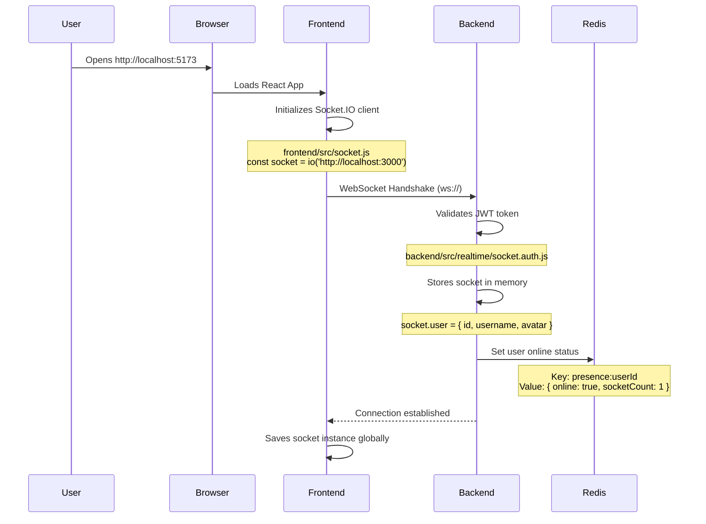
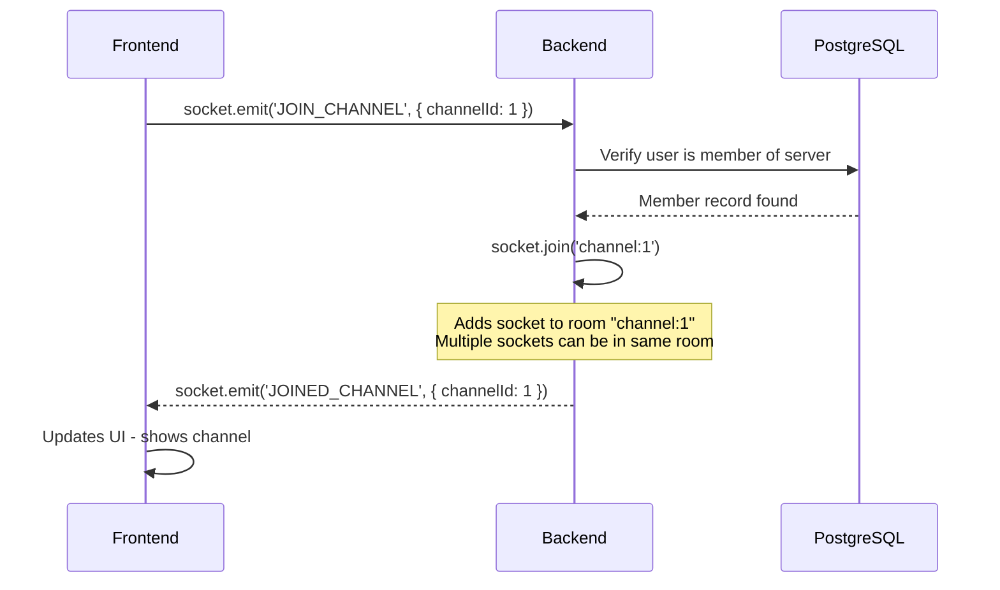
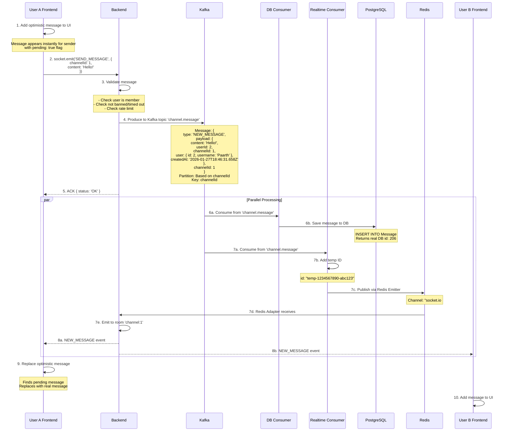

# Discord-like Chat Application - Complete Architecture Flow

## 📋 Executive Summary

This document explains the complete data flow of our real-time chat application, from when a user opens the web application to when messages are delivered to other users in real-time.

---

## 🏗️ System Components

### 1. **Frontend** (React + Vite)
- **Technology:** React.js with Socket.IO client
- **Port:** 5173 (development)
- **Location:** `frontend/`

### 2. **Backend** (Node.js + Express)
- **Technology:** Express.js + Socket.IO server
- **Port:** 3000
- **Location:** `backend/`
- **Responsibilities:**
  - User authentication
  - WebSocket connection management
  - Message validation
  - Kafka producer

### 3. **Backend Consumer** (Independent Node.js Service)
- **Technology:** Node.js + KafkaJS
- **Location:** `backend-consumer/`
- **Two Independent Consumers:**
  - **Database Consumer:** Saves messages to PostgreSQL
  - **Realtime Consumer:** Broadcasts messages via Redis to all backend instances

### 4. **PostgreSQL Database**
- **Port:** 5432
- **Purpose:** Persistent storage for users, servers, channels, messages

### 5. **Apache Kafka**
- **Port:** 9092
- **Purpose:** Message queue for async processing
- **Topics:**
  - `channel.message` - Server channel messages
  - `dm.message` - Direct messages

### 6. **Redis**
- **Port:** 6379
- **Purpose:**
  - Pub/Sub for Socket.IO horizontal scaling
  - User presence tracking
  - Typing indicators

### 7. **Zookeeper**
- **Port:** 2181
- **Purpose:** Kafka coordination

---

## 🔄 Complete Message Flow

### **Step 1: User Opens Application**



**Where Socket ID is Stored:**
- **In Backend Memory:** Each Socket.IO connection object has a unique `socket.id` (e.g., `"5XJACI1ro_dU0UpNAABC"`)
- **Not Stored in Database:** Socket IDs are temporary and change on reconnection
- **Socket.IO Internal Map:** Backend maintains a map of `socketId → user data`

---

### **Step 2: User Joins a Channel**



**What is a "Room"?**
- A **room** is a Socket.IO concept - a group of connected sockets
- When a message is sent to `room "channel:1"`, ALL sockets in that room receive it
- Rooms are stored in **Backend memory only**
- Example: If User A and User B both join channel 1, both their sockets are in room `"channel:1"`

---

### **Step 3: User Sends a Message**



---

## 📊 Detailed Component Responsibilities

### **Frontend (React)**

**Files:**
- `frontend/src/socket.js` - Socket.IO client initialization
- `frontend/src/components/ChatArea.jsx` - Message UI and event handlers

**What Frontend Sends:**
```javascript
// Join channel
socket.emit('JOIN_CHANNEL', { channelId: 1 });

// Send message
socket.emit('SEND_MESSAGE', { 
  channelId: 1, 
  content: 'Hello!' 
});

// Typing indicator
socket.emit('TYPING_START', { channelId: 1 });
socket.emit('TYPING_STOP', { channelId: 1 });
```

**What Frontend Receives:**
```javascript
// New message from anyone
socket.on('NEW_MESSAGE', (message) => {
  // message = { id, content, userId, channelId, user, createdAt }
});

// Typing indicators
socket.on('TYPING_START', (data) => {
  // data = { userId, username, channelId }
});

// Join confirmation
socket.on('JOINED_CHANNEL', (data) => {
  // data = { channelId }
});
```

---

### **Backend**

**Files:**
- `backend/src/server.js` - Express + Socket.IO initialization
- `backend/src/realtime/socket.auth.js` - JWT authentication middleware
- `backend/src/realtime/socket.events.js` - All Socket.IO event handlers
- `backend/src/kafka/producer.js` - Kafka producer wrapper

**Socket.IO Setup:**
```javascript
// 1. Create Socket.IO server with Redis Adapter
const io = new Server(httpServer, {
  cors: { origin: 'http://localhost:5173' }
});

// 2. Attach Redis Adapter for pub/sub
const pubClient = redis.createClient({ url: 'redis://localhost:6379' });
const subClient = pubClient.duplicate();
io.adapter(createAdapter(pubClient, subClient));

// 3. Authentication middleware
io.use(socketAuth); // Verifies JWT token

// 4. Connection handler
io.on('connection', (socket) => {
  // socket.user = { id, username, avatar } set by auth middleware
});
```

**Event Handlers:**
- `JOIN_CHANNEL` - Adds socket to room
- `LEAVE_CHANNEL` - Removes socket from room
- `SEND_MESSAGE` - Validates and produces to Kafka
- `TYPING_START/STOP` - Broadcasts typing status to room
- `EDIT_MESSAGE` - Updates message in DB via REST API
- `DELETE_MESSAGE` - Soft deletes message

---

### **Kafka**

**Topics Configuration:**

| Topic | Partitions | Purpose | Key | Consumer Groups |
|-------|-----------|---------|-----|----------------|
| `channel.message` | 5 | Channel messages | `channelId` | `database-group`, `realtime-group` |
| `dm.message` | 3 | Direct messages | `conversationKey` | `database-group`, `realtime-group` |

**Why Kafka?**
1. **Decoupling:** Backend doesn't wait for DB writes
2. **Reliability:** Messages are persisted in Kafka until consumed
3. **Scalability:** Multiple consumers can process messages in parallel
4. **Ordering:** Messages from same channel stay in same partition (ordered)

---

### **Backend Consumer**

**Two Independent Consumers:**

#### **1. Database Consumer** (`backend-consumer/src/consumers/database.js`)

**Purpose:** Save messages to PostgreSQL

```javascript
// Consumes from 'channel.message' topic
// Consumer Group: 'database-group'

await prisma.message.create({
  data: {
    content: payload.payload.content,
    userId: payload.payload.userId,
    channelId: payload.channelId,
    createdAt: payload.payload.createdAt
  },
  include: { user: true }
});

// Returns message with real DB ID (e.g., id: 206)
```

#### **2. Realtime Consumer** (`backend-consumer/src/consumers/realtime.js`)

**Purpose:** Broadcast messages to connected clients via Redis

```javascript
// Consumes from 'channel.message' topic
// Consumer Group: 'realtime-group'

// Add temporary ID for React keys
const messageWithId = {
  ...payload.payload,
  channelId: payload.channelId,
  id: `temp-${Date.now()}-${Math.random().toString(36).substr(2, 9)}`,
  createdAt: payload.payload.createdAt || new Date().toISOString()
};

// Emit via Redis Emitter
io.to(`channel:${payload.channelId}`).emit('NEW_MESSAGE', messageWithId);
```

**Redis Emitter vs Socket.IO:**
- The realtime consumer doesn't have Socket.IO connections
- It uses `@socket.io/redis-emitter` to publish to Redis
- The backend's Redis Adapter subscribes and broadcasts to connected sockets

---

### **Redis**

**Three Main Uses:**

#### **1. Socket.IO Pub/Sub (Horizontal Scaling)**

```
Redis Channel: "socket.io#/#channel:1#"
Purpose: Allow multiple backend instances to share messages

Flow:
1. Realtime Consumer publishes to Redis
2. All Backend instances (with Redis Adapter) receive
3. Each Backend broadcasts to its connected sockets
```

#### **2. User Presence**

```redis
Key: presence:{userId}
Value: {
  "online": true,
  "socketCount": 2,
  "lastSeen": "2026-01-27T18:46:31.658Z"
}
TTL: 300 seconds (auto-expire if user disconnects)
```

#### **3. Typing Indicators**

```redis
Key: typing:channel:{channelId}:{userId}
Value: {
  "userId": 2,
  "username": "Paarth"
}
TTL: 5 seconds (auto-expire if user stops typing)
```

---

## 🗂️ Data Storage Summary

### **In-Memory (Backend)**
- ✅ Socket connections (`socket.id → user data`)
- ✅ Socket rooms (`room "channel:1" → [socketA, socketB]`)
- ❌ Messages (not stored, only passed through)

### **Redis (Temporary)**
- ✅ User presence (TTL: 5 minutes)
- ✅ Typing indicators (TTL: 5 seconds)
- ✅ Socket.IO pub/sub channels (real-time only)

### **Kafka (Short-term Queue)**
- ✅ Messages waiting to be consumed
- ⏱️ Retention: 7 days (configurable)
- ✅ Logs of all message events

### **PostgreSQL (Permanent)**
- ✅ Users
- ✅ Servers
- ✅ Channels
- ✅ Messages (with real DB IDs)
- ✅ Server members
- ✅ Direct message channels

---

## 📈 Excel Diagram Suggestions

### **Diagram 1: Component Architecture**
```
+----------------+     +----------------+     +------------------+
|   Frontend     |     |    Backend     |     | Backend Consumer |
| (React + WS)   |<--->| (Socket.IO +   |<--->|  (Kafka)        |
|                |     |  Redis Adapter)|     |                  |
| Port: 5173     |     | Port: 3000     |     | - DB Consumer    |
+----------------+     +----------------+     | - RT Consumer    |
                             |                +------------------+
                             |                        |
              +--------------+-------------+          |
              |              |             |          |
         +--------+     +---------+   +---------+     |
         | Redis  |     |  Kafka  |   |  Zook.  |     |
         | 6379   |     |  9092   |   |  2181   |     |
         +--------+     +---------+   +---------+     |
                                                      |
                                              +--------------+
                                              |  PostgreSQL  |
                                              |    5432      |
                                              +--------------+
```

### **Diagram 2: Message Flow Timeline**
| Step | Component | Action | Data |
|------|-----------|--------|------|
| 1 | User A Frontend | Optimistic UI update | `{ pending: true }` |
| 2 | User A Frontend | `SEND_MESSAGE` event | `{ channelId, content }` |
| 3 | Backend | Validate & produce to Kafka | `{ type, payload, channelId }` |
| 4 | Kafka | Store in partition | Partition based on channelId |
| 5 | DB Consumer | Save to PostgreSQL | Returns `{ id: 206 }` |
| 6 | Realtime Consumer | Add temp ID & publish to Redis | `{ id: "temp-xyz" }` |
| 7 | Backend (Redis Adapter) | Receive from Redis | |
| 8 | Backend | Broadcast to room | `io.to('channel:1').emit()` |
| 9 | User A & B Frontends | Receive `NEW_MESSAGE` | Display in UI |

### **Diagram 3: Socket Connection Flow**
```
User Opens App
     ↓
Frontend: io('http://localhost:3000')
     ↓
WebSocket Handshake
     ↓
Backend: socketAuth middleware
     ↓
JWT Token Verification
     ↓
socket.user = { id, username, avatar }
     ↓
Redis: SET presence:userId
     ↓
Connection Established
     ↓
Frontend: socket.emit('JOIN_CHANNEL', { channelId: 1 })
     ↓
Backend: socket.join('channel:1')
     ↓
Ready to send/receive messages
```

---

## 🔍 Key Design Decisions

### **1. Why Kafka Instead of Direct Socket.IO?**
- **Reliability:** Messages are persisted even if consumers are down
- **Decoupling:** Backend doesn't wait for DB writes (faster response)
- **Scalability:** Can add more consumers without changing backend code
- **Retry Logic:** Failed DB writes can be retried automatically

### **2. Why Two Separate Consumers?**
- **Independence:** DB failures don't affect real-time delivery
- **Performance:** Both can process messages in parallel
- **Fault Tolerance:** If DB consumer is slow, realtime is still fast

### **3. Why Redis Adapter?**
- **Horizontal Scaling:** Multiple backend instances can share Socket.IO events
- **Pub/Sub:** Realtime consumer can broadcast without direct Socket.IO connection

### **4. Why Temporary IDs?**
- **React Keys:** React needs unique `key` props to render lists
- **Speed:** Don't wait for DB save to return real ID
- **Later Fix:** Will be replaced with real DB IDs in future

---

## 🚀 Performance Metrics

**Typical Message Latency:**
1. Frontend → Backend: **< 5ms** (WebSocket)
2. Backend → Kafka: **< 10ms** (async)
3. Kafka → Consumers: **< 50ms** (both parallel)
4. DB Save: **< 100ms** (PostgreSQL insert)
5. Redis Pub/Sub: **< 10ms** (in-memory)
6. Backend → All Users: **< 20ms** (WebSocket broadcast)

**Total Real-time Delivery: ~100ms**

---

## 📚 File Reference

### **Backend**
- [backend/src/server.js](file:///c:/Users/salok/OneDrive/Desktop/discord/backend/src/server.js) - Express + Socket.IO + Redis Adapter setup
- [backend/src/realtime/socket.auth.js](file:///c:/Users/salok/OneDrive/Desktop/discord/backend/src/realtime/socket.auth.js) - JWT authentication
- [backend/src/realtime/socket.events.js](file:///c:/Users/salok/OneDrive/Desktop/discord/backend/src/realtime/socket.events.js) - Event handlers
- [backend/src/kafka/producer.js](file:///c:/Users/salok/OneDrive/Desktop/discord/backend/src/kafka/producer.js) - Kafka producer wrapper

### **Backend Consumer**
- [backend-consumer/src/consumers/database.js](file:///c:/Users/salok/OneDrive/Desktop/discord/backend-consumer/src/consumers/database.js) - Saves to PostgreSQL
- [backend-consumer/src/consumers/realtime.js](file:///c:/Users/salok/OneDrive/Desktop/discord/backend-consumer/src/consumers/realtime.js) - Broadcasts via Redis

### **Frontend**
- [frontend/src/socket.js](file:///c:/Users/salok/OneDrive/Desktop/discord/frontend/src/socket.js) - Socket.IO client
- [frontend/src/components/ChatArea.jsx](file:///c:/Users/salok/OneDrive/Desktop/discord/frontend/src/components/ChatArea.jsx) - Message UI

### **Configuration**
- [docker-kafka/docker-compose.yml](file:///c:/Users/salok/OneDrive/Desktop/discord/docker-kafka/docker-compose.yml) - Infrastructure setup
- [backend/prisma/schema.prisma](file:///c:/Users/salok/OneDrive/Desktop/discord/backend/prisma/schema.prisma) - Database schema
