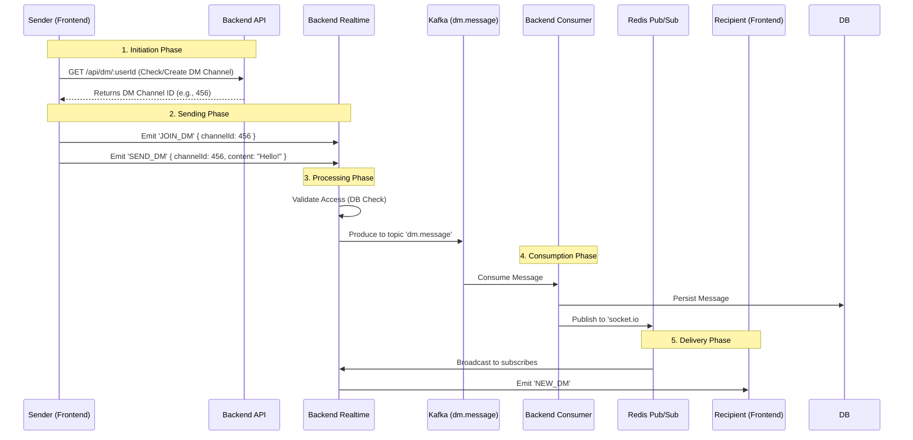

# Direct Message (DM) Flow: Deep Dive

This document details the end-to-end processing of Direct Messages in Talkora, from the user clicking "Send" to the recipient receiving it. It parallels the Channel Message flow but uses distinct events (`SEND_DM`, `NEW_DM`) and data structures.

## 🏗️ 1. The High-Level Architecture



---

## 🔍 2. Detailed Process Breakdown

### Phase 1: Initiation (REST API)
**File**: `frontend/src/services/dmService.js` & `backend-api/src/controllers/dmController.js`

Before chatting, a "DM Channel" must exist.
1.  **Frontend**: Calls `createOrGetDMChannel(userId)`.
2.  **Backend API**:
    *   Checks if users are friends.
    *   Checks if a `DirectMessageChannel` row exists between `user1` and `user2`.
    *   If not, creates it.
    *   Returns the `channel.id` (This is the room ID).

### Phase 2: Sending (Realtime Socket)
**File**: `backend-realtime/src/realtime/socket.events.js` (Line 360)

The actual message is sent via WebSocket, NOT REST.
1.  **Event**: `socket.on('SEND_DM', ...)` triggered.
2.  **Rate Limit**: Checks if user is spamming.
3.  **Validation**:
    *   `prisma.directMessageChannel.findUnique({ id: 456 })`
    *   Ensures `socket.user.id` is either `user1Id` or `user2Id` of the channel. **Critical Security Check**.
4.  **Kafka Production**:
    *   Topic: `dm.message`
    *   Key: `${user1}:${user2}` (Ensures strict ordering per conversation).
    *   Payload: `{ type: 'NEW_DM', channelId: 456, content: ... }`

### Phase 3: Consumption Rule (The Separator)
**File**: `backend-consumer/src/consumers/realtime.js` (Line 83)

The consumer specifically listens for the `dm.message` topic.
1.  **Differentiator**: It checks `if (topic === 'dm.message')`.
2.  **Event Type**: If `payload.type === 'NEW_DM'`:
    *   It prepares a broadcast.
    *   **Crucial Difference**: It emits to room `dm:${channelId}` instead of `channel:${channelId}`.

### Phase 4: Delivery (Redis -> Socket)
**File**: `backend-consumer/src/consumers/realtime.js` (Line 90)

```javascript
io.to(`dm:${payload.channelId}`).emit('NEW_DM', messageWithChannel);
```

1.  **Publisher**: The consumer (via Redis Emitter) publishes to channel `socket.io#dm:456#`.
2.  **Subscribers**: All Realtime Servers receive this.
3.  **Final Mile**:
    *   Server A checks: "Is User A (Sender) connected here?" -> Yes -> Emits `NEW_DM` (So sender sees their own message confirmed).
    *   Server B checks: "Is User B (Recipient) connected here?" -> Yes -> Emits `NEW_DM`.
    *   User C (not in DM) -> Server ignores.

---

## 🛡️ Key Security Features
1.  **Friend-Only-First**: You cannot start a DM via REST API unless you are friends (`dmController.js` line 164).
2.  **Participant Validation**: Steps 450-456 in `socket.events.js` ensure you can't listen/type in a DM you don't belong to.
3.  **Encapsulation**: DM logic is isolated in `dm.message` Kafka topic, preventing queue blocking from busy public channels.

## ⚠️ Potential Bottlenecks (Optimization targets)
1.  **Validation Query**: `prisma.directMessageChannel.findUnique` runs on **every single message**. Cache this in Redis (`dm:access:456:user1`) to save DB items.
2.  **Friend Check**: The initial "Start DM" check is heavy.
