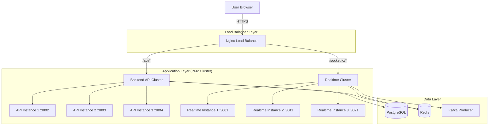

# Load Balancing Architecture: The Missing Piece

To scale **Talkora** to 100k users, adding a load balancer (Nginx) is the first critical step. A load balancer distributes traffic across your multiple backend instances, preventing any single server from crashing under load.

## 🏗️ The New Architecture with Load Balancer



---

## ⚙️ Nginx Configuration Strategy

You need **two separate strategies**:
1. **API (Stateless)**: Standard Round-Robin (distributes requests evenly).
2. **Realtime (Stateful)**: Sticky Sessions (IP Hash) are **MANDATORY** for Socket.IO handshake to work.

### `nginx.conf` Example

```nginx
http {
    # 1. API Upstream (Round Robin)
    upstream backend_api {
        server localhost:3002;
        server localhost:3003;
        server localhost:3004;
        server localhost:3005;
        server localhost:3006;
    }

    # 2. Realtime Upstream (Sticky Sessions)
    upstream backend_realtime {
        ip_hash; # CRITICAL: Ensures same user hits same server
        server localhost:3001;
        server localhost:3011;
        server localhost:3021;
        server localhost:3031;
        server localhost:3041;
        server localhost:3051;
        server localhost:3061;
        server localhost:3071;
        server localhost:3081;
        server localhost:3091;
    }

    server {
        listen 80;
        server_name talkora.com;

        # API - Standard Proxy
        location /api/ {
            proxy_pass http://backend_api;
            proxy_set_header Host $host;
            proxy_set_header X-Real-IP $remote_addr;
        }

        # Socket.IO - WebSocket Proxy
        location /socket.io/ {
            proxy_pass http://backend_realtime;
            proxy_http_version 1.1;
            proxy_set_header Upgrade $http_upgrade;
            proxy_set_header Connection "upgrade";
            proxy_set_header Host $host;
            proxy_set_header X-Real-IP $remote_addr;
            
            # Important timeouts for long-running WS connections
            proxy_read_timeout 3600;
            proxy_send_timeout 3600;
        }
    }
}
```

---

## 🚦 End-to-End Flow with Load Balancer

### Scenario 1: User Logs In (REST API)
1. **User** sends `POST /api/auth/login`.
2. **Nginx** receives request.
3. **Nginx** looks at `upstream backend_api`.
4. **Nginx** picks `localhost:3003` (Round Robin).
5. **API Instance 2** processes login, returns JWT in cookie.
6. **Response** goes back through Nginx to User.

### Scenario 2: User Connects WebSocket (Realtime)
1. **User** (IP: 203.0.113.5) connects to `ws://talkora.com/socket.io`.
2. **Nginx** receives connection upgrade request.
3. **Nginx** calculates hash of `203.0.113.5`.
4. **Nginx** assigns user to **Realtime Instance 3** (`localhost:3021`).
5. **Socket.IO Handshake** completes on Instance 3.
6. **Persistent connection** established between User <-> Nginx <-> Instance 3.
   > *Note: Even if Instance 3 is busy, this user MUST talk to Instance 3 for the duration of this session.*

### Scenario 3: User A Sends Message to User B
**(User A is on Instance 1, User B is on Instance 3)**

1. **User A** emits `SEND_MESSAGE` via WebSocket to Nginx.
2. **Nginx** forwards to **Realtime Instance 1** (sticky session).
3. **Instance 1** validates and produces to **Kafka**.
4. **Realtime Consumer** picks up message from Kafka.
5. **Consumer** publishes to **Redis Channel** `socket.io#channel:123#`.
6. **Redis** broadcasts to **ALL** Realtime Instances (1, 2, 3...).
7. **Instance 3** receives Redis message.
8. **Instance 3** checks local rooms: "I have User B!"
9. **Instance 3** emits to Nginx.
10. **Nginx** forwards to **User B**.

---

## 🧪 Optimization Checklist for High Load

1.  **Increase File Descriptors**: Linux defaults to 1024 open files. For 100k connections, run `ulimit -n 100000`.
2.  **Tune Nginx Worker Connections**:
    ```nginx
    events {
        worker_connections 10000; # Allow 10k connections per worker
    }
    ```
3.  **Kernel TCP Tuning** (sysctl.conf):
    - Increase ephemeral port range.
    - Reduce TCP timeout settings (`net.ipv4.tcp_fin_timeout`).
    - Enable TCP Fast Open.

---

## 🛡️ Failure Scenarios

| Scenario | Result | Recovery |
| :--- | :--- | :--- |
| **Realtime Instance 3 Crashes** | Users on Inst 3 disconnect. | Client auto-reconnects -> Nginx sees Inst 3 down -> Routes to Inst 4 -> New session starts. |
| **API Instance 2 Crashes** | 1/5th of API requests fail once. | Nginx marks Inst 2 as "down" and stops sending traffic instantly. Retry works. |
| **Nginx Crashes** | **TOTAL OUTAGE** | Run multiple Nginx instances with specific DNS (Round Bond DNS) or use AWS ALB / Cloudflare. |

This setup gives you **horizontal scalability**. To handle 100k users, you just keep adding more instances to the `upstream` blocks!
