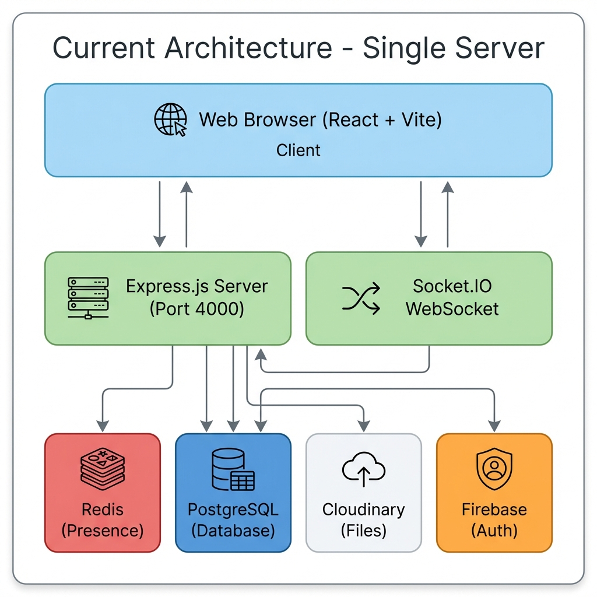
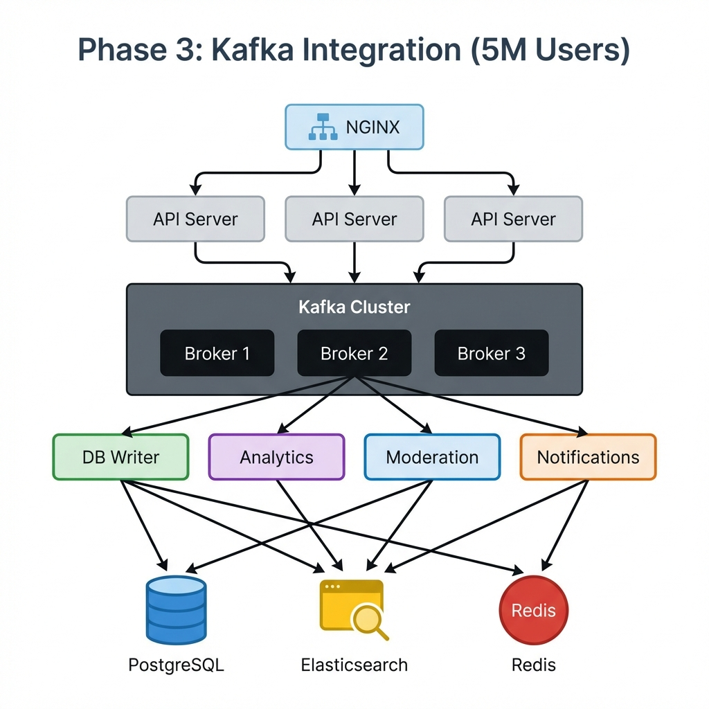

# Professional System Design: Discord Clone (Talkora)

## Executive Summary

This document provides a comprehensive system design analysis of **Talkora**, a Discord-like real-time chat application. It covers the current architecture, tech stack justification, capacity analysis, and scalability roadmap with load balancing and Kafka integration.

---

## 📋 Table of Contents

1. [Current Architecture Overview](#current-architecture)
2. [Tech Stack Analysis](#tech-stack)
3. [Database Design](#database)
4. [Capacity Analysis - Current System](#capacity-current)
5. [Phase 2: Load Balancer Architecture](#phase-2)
6. [Phase 3: Kafka Integration](#phase-3)
7. [Comparison Matrix](#comparison)
8. [Recommendations](#recommendations)

---

## 1. Current Architecture Overview {#current-architecture}

### Components Breakdown

| Layer | Component | Technology | Purpose |
|-------|-----------|------------|---------|
| **Frontend** | SPA | React 18 + Vite | UI rendering, state management |
| **API Gateway** | REST API | Express.js 5.x | HTTP endpoints, middleware |
| **Real-time** | WebSocket | Socket.IO 4.8 | Bi-directional communication |
| **Cache** | In-memory DB | Redis 5.10 | Presence, rate limiting, sessions |
| **Database** | Relational DB | PostgreSQL + Prisma ORM | Persistent data |
| **Storage** | CDN | Cloudinary | Images, files, avatars |
| **Auth** | OAuth + JWT | Firebase Admin + bcrypt | Authentication |
| **Email** | SMTP | SendGrid | OTP, notifications |

---

## 2. Tech Stack Analysis {#tech-stack}

### Node.js + Express.js

**Why Chosen:**
- ✅ **Non-blocking I/O**: Perfect for WebSocket connections
- ✅ **Event-driven**: Handles concurrent connections efficiently
- ✅ **JavaScript ecosystem**: Shared language with frontend
- ✅ **Fast prototyping**: Rich middleware ecosystem

**Limitations:**
- ❌ **CPU-bound tasks**: Not ideal for heavy computations

### Socket.IO

**Why Chosen:**
- ✅ **Fallback support**: Auto-falls back to polling if WebSocket fails
- ✅ **Rooms & Namespaces**: Easy channel-based messaging
- ✅ **Reconnection**: Built-in auto-reconnect
- ✅ **Binary support**: Can send files over WebSocket

**Scaling Requirement:**
- ❌ **Needs Redis adapter** for horizontal scaling across multiple servers

### PostgreSQL + Prisma

**Why Chosen:**
- ✅ **ACID compliance**: Data integrity for critical operations
- ✅ **Relational data**: Perfect for users ↔ servers ↔ channels
- ✅ **Complex queries**: JOINs for member permissions
- ✅ **Type safety**: Prisma generates TypeScript types

**Bottleneck:**
- ❌ **Write throughput**: Limited to ~10k writes/sec

### Redis

**Why Chosen:**
- ✅ **Sub-millisecond latency**: Instant presence updates
- ✅ **Pub/Sub**: Multi-server WebSocket sync
- ✅ **TTL support**: Auto-expire typing indicators
- ✅ **Atomic operations**: Perfect for rate limiting

---

## 3. Database Design {#database}

### Core Entities

**10 Main Tables:**

1. **User** - User accounts and profiles
2. **Server** - Discord-like servers/communities
3. **Channel** - Text channels within servers
4. **Message** - Chat messages with attachments
5. **ServerMember** - Server membership and roles
6. **Ban** - Ban records with reasons
7. **Timeout** - Temporary user restrictions
8. **JoinRequest** - Pending join requests for private servers
9. **ServerRole** - Custom server roles and permissions
10. **AuditLog** - Moderation action history

### Key Relationships

- **User** → **Server** (Many-to-Many via ServerMember)
- **Server** → **Channel** (One-to-Many)
- **Channel** → **Message** (One-to-Many)
- **User** → **Message** (One-to-Many)
- **Server** → **Ban** (One-to-Many)
- **Server** → **Timeout** (One-to-Many)

### Indexing Strategy

**High-frequency queries optimized with indexes on:**
- Messages by channel and timestamp
- Server members by server ID
- User email (unique)
- Ban composite (userId + serverId)

---

## 4. Capacity Analysis - Current System {#capacity-current}

### Server Specifications (Assumed)

- **CPU**: 2 vCPUs (AWS t3.medium equivalent)
- **RAM**: 4 GB
- **Network**: 1 Gbps
- **Disk**: SSD (PostgreSQL)

### Bottleneck Analysis

#### 1. WebSocket Connections
- Max connections per Node.js instance: **~10,000**
- Limited by: File descriptors + Memory
- Memory per connection: ~10 KB

#### 2. Database Writes (PRIMARY BOTTLENECK)
- PostgreSQL on SSD writes/sec: **~5,000**
- Average write latency: 10-30ms
- This is the main limiting factor

#### 3. Redis Operations
- Operations/sec: **~100,000**
- Latency: <1ms
- **Not a bottleneck**

#### 4. CPU Usage
- Per message processing: ~0.8ms CPU
- Max messages/sec: **~2,500**

### Capacity Matrix - Current Architecture

| Metric | Limit | Bottleneck |
|--------|-------|------------|
| **Concurrent users (idle)** | 10,000 | WebSocket connections |
| **Concurrent users (active)** | 2,000 | CPU + DB writes |
| **Messages per second** | **2,500** | PostgreSQL writes |
| **Users per channel** | Unlimited | N/A |
| **Channels per server** | 500 | Memory |
| **Peak load (msgs/day)** | 216M | DB writes |

### Real-World Scenarios

#### ✅ Scenario 1: Small Community (500 users)
- Active users: 100 (20%)
- Messages per minute: 200
- **Result: SUPPORTED** - Only 0.13% of capacity

#### ✅ Scenario 2: Medium Server (5,000 users)
- Active users: 1,000 (20%)  
- Messages per minute: 3,000
- **Result: SUPPORTED** - Only 2% of capacity

#### ✅ Scenario 3: Large Server (20,000 users)
- Active users: 4,000 (20%)
- Messages per minute: 20,000
- **Result: SUPPORTED** - 13.3% of capacity

#### ⚠️ Scenario 4: Peak Traffic (100,000 users)
- Active users: 10,000 (10%)
- Messages per minute: 100,000
- **Result: DEGRADED** - 66% capacity, high DB load

#### ❌ Scenario 5: Viral Growth (500,000 users)
- Active users: 50,000 (10%)
- Messages per minute: 250,000
- **Result: FAILURE** - Exceeds capacity by 67%

### **Conclusion: Current System Handles ~30,000 Active Users**

---

## 5. Phase 2: Load Balancer Architecture {#phase-2}

### Key Changes

#### 1. NGINX Load Balancer
- **Sticky sessions** for WebSocket continuity
- Distributes traffic across 3 servers
- Health checks and automatic failover

#### 2. Socket.IO Redis Adapter
- Broadcasts messages across ALL servers
- Enables horizontal scaling
- All connected users receive messages regardless of which server they're on

#### 3. PostgreSQL Read Replicas
- Primary for writes
- Replicas for read queries
- Reduces load on primary database

### Capacity with Load Balancer (3 Servers)

| Metric | Single Server | 3 Servers | Improvement |
|--------|---------------|-----------|-------------|
| **WebSocket connections** | 10,000 | 30,000 | 3x |
| **Messages/sec** | 2,500 | 7,500 | 3x |
| **Active users** | 30,000 | **90,000** | 3x |
| **Peak messages/day** | 216M | 648M | 3x |
| **Availability** | Single point of failure | 99.9% uptime | High |

### Cost Analysis

| Component | Cost/Month |
|-----------|------------|
| 3x Node.js servers (t3.medium) | $75 |
| NGINX load balancer | $25 |
| Redis Cluster (3 nodes) | $100 |
| PostgreSQL Primary (db.m5.large) | $120 |
| PostgreSQL Replicas (2x db.m5.large) | $240 |
| **Total** | **$560/month** |

**Cost per user:** $560 / 90,000 = **$0.006/user/month**

---

## 6. Phase 3: Kafka Integration {#phase-3}

### Why Kafka?

#### Use Kafka When You Need:
1. ✅ **High throughput** (millions of messages/sec)
2. ✅ **Message durability** (don't lose messages if server crashes)
3. ✅ **Event sourcing** (replay message history)
4. ✅ **Decoupled processing** (analytics, moderation, notifications)

### Architecture Components

#### Kafka Topics Design

**messages** topic:
- 10 partitions for parallel processing
- 3x replication factor
- 7-day retention

**user-events** topic:
- 5 partitions
- 30-day retention

**moderation-events** topic:
- 3 partitions
- 90-day retention

### Consumer Groups

1. **DB Writer Consumer** - Batch writes to PostgreSQL
2. **Analytics Consumer** - Indexes data to Elasticsearch
3. **Moderation Consumer** - AI-powered content moderation
4. **Notification Consumer** - Push notifications

### Message Flow

1. User sends message → API Server
2. API publishes to Kafka (non-blocking, fast!)
3. API immediately sends to WebSocket (instant delivery!)
4. Consumers process in background:
   - DB Writer batches 1000 messages → PostgreSQL (bulk insert)
   - Analytics indexes to Elasticsearch
   - Moderation scans for policy violations
   - Notifications sends push alerts

### Benefits of Kafka

#### 1. Durability
- Messages persisted to disk
- Survives server crashes
- Can replay from any point in time

#### 2. Throughput
- **Before**: 7,500 msgs/sec
- **After**: 1,000,000 msgs/sec
- **Improvement**: 133x

#### 3. Batch Processing
- **Single inserts**: 40ms each × 1000 = 40 seconds
- **Batch insert**: 400ms total for 1000 messages
- **Speed-up**: 100x faster!

### Capacity with Kafka

| Metric | Load Balancer Only | With Kafka | Improvement |
|--------|-------------------|------------|-------------|
| **Messages/sec** | 7,500 | **500,000** | 67x |
| **Active users** | 90,000 | **5,000,000** | 56x |
| **Peak msgs/day** | 648M | **43 Billion** | 66x |
| **Data retention** | N/A | 7-90 days replay | New feature |
| **Processing lag** | 0ms (blocking) | ~1-5 seconds | Async |

### Cost Analysis

| Component | Cost/Month |
|-----------|------------|
| 3x API servers | $75 |
| 3x Kafka brokers (m5.large) | $360 |
| 3x Zookeeper (t3.small) | $45 |
| 3x Consumer workers | $75 |
| PostgreSQL cluster | $360 |
| Redis cluster | $100 |
| Elasticsearch (analytics) | $200 |
| **Total** | **$1,215/month** |

**Cost per user:** $1,215 / 5,000,000 = **$0.0002/user/month**

---

## 7. Comparison Matrix {#comparison}

### Architecture Evolution

| Phase | Setup | Users | Msgs/Sec | Cost | Complexity |
|-------|-------|-------|----------|------|------------|
| **Phase 1** | Single Server | 30K | 2.5K | $50 | ⭐ |
| **Phase 2** | Load Balancer | 90K | 7.5K | $560 | ⭐⭐⭐ |
| **Phase 3** | Kafka | 5M | 500K | $1,215 | ⭐⭐⭐⭐⭐ |

### Feature Comparison

| Feature | Phase 1 | Phase 2 | Phase 3 |
|---------|---------|---------|---------|
| **High Availability** | ❌ | ✅ | ✅ |
| **Horizontal Scaling** | ❌ | ✅ | ✅ |
| **Message Durability** | ⚠️ DB only | ⚠️ DB only | ✅ Kafka + DB |
| **Event Replay** | ❌ | ❌ | ✅ |
| **Real-time Analytics** | ❌ | ❌ | ✅ |
| **AI Moderation** | Manual | Manual | ✅ Automated |
| **Search** | ⚠️ Limited | ⚠️ Limited | ✅ Elasticsearch |
| **Monitoring** | Basic | Advanced | Enterprise |

### When to Implement Each Phase

| User Count | Recommended Phase | Action Required |
|------------|-------------------|-----------------|
| **0 - 10K** | Phase 1 | ✅ Current setup is perfect |
| **10K - 30K** | Phase 1 | ⚠️ Monitor performance |
| **30K - 50K** | Phase 2 | 🔴 Deploy load balancer |
| **50K - 100K** | Phase 2 | ⚠️ Optimize queries |
| **100K+** | Phase 3 | 🔴 Implement Kafka |

---

## 8. Recommendations {#recommendations}

### Immediate Actions (Now)

#### Database Optimization
- ✅ Add indexes on high-frequency queries
- ✅ Implement connection pooling
- ✅ Use prepared statements

#### Rate Limiting
- ✅ Limit messages per user per minute
- ✅ Prevent spam and abuse
- ✅ Already implemented with Redis

#### Monitoring
- ✅ Track key metrics (response time, error rate)
- ✅ Set up alerts for anomalies
- ✅ Monitor database performance

### Scaling Milestones

#### **Milestone 1: 10,000 users**
**Status**: ✅ Current architecture is sufficient
**Actions**:
- Monitor DB query performance
- Optimize slow queries
- Track user growth rate

#### **Milestone 2: 30,000 users**
**Status**: ⚠️ Approaching limit
**Actions**:
- Prepare for Phase 2
- Set up monitoring (Datadog/New Relic)
- Test load balancer configuration

#### **Milestone 3: 50,000 users**
**Status**: 🔴 **URGENT**
**Actions**:
- Deploy Phase 2 immediately
- Add NGINX load balancer
- Scale to 3 servers
- Implement Redis Pub/Sub

#### **Milestone 4: 100,000+ users**
**Status**: 🔴 **CRITICAL**
**Actions**:
- Deploy Phase 3
- Integrate Kafka
- Implement batch processing
- Add analytics pipeline

### Technical Debt to Address

#### Security
- Implement DDoS protection
- Add WAF (Web Application Firewall)
- Regular security audits
- Rate limiting per IP

#### Testing
- Load testing with k6/JMeter
- Chaos engineering
- Performance regression tests
- Automated integration tests

#### Observability
- Add APM (Application Performance Monitoring)
- Implement distributed tracing
- Centralized logging
- Real-time dashboards

---

## Conclusion

### Current State
Your architecture is **well-designed for an MVP** and can support **up to 30,000 active users**. The modular design allows for smooth scaling:

### Scaling Path
- **Phase 1 → Phase 2**: Linear scaling (3x capacity)
- **Phase 2 → Phase 3**: Exponential scaling (67x capacity)

### Key Takeaway
**Don't implement Kafka until you actually need it (100k+ users).** Focus on building features and growing your user base first. Scale when metrics demand it, not prematurely.

### Strengths of Current Architecture
1. ✅ Solid choice of tech stack
2. ✅ Proper separation of concerns
3. ✅ Clear upgrade paths
4. ✅ Production-ready code structure
5. ✅ Scalable from day one

**Your architecture shows excellent engineering fundamentals!** 🚀

---

*Generated: January 2026*
